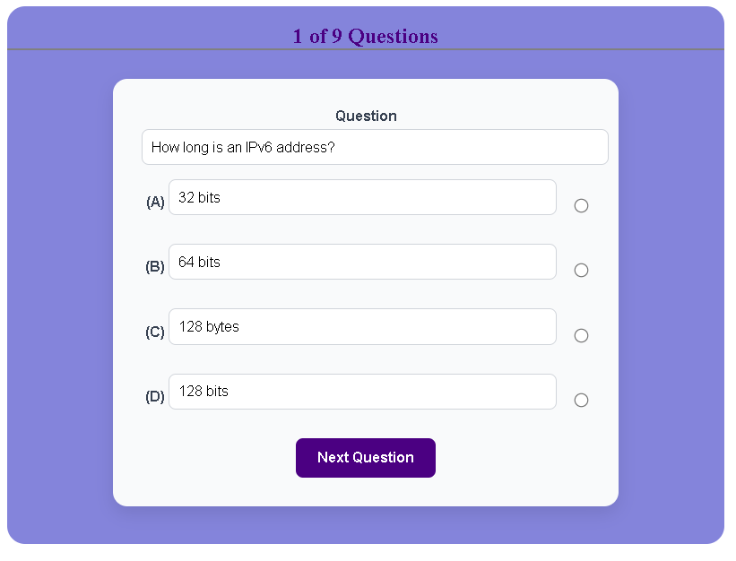
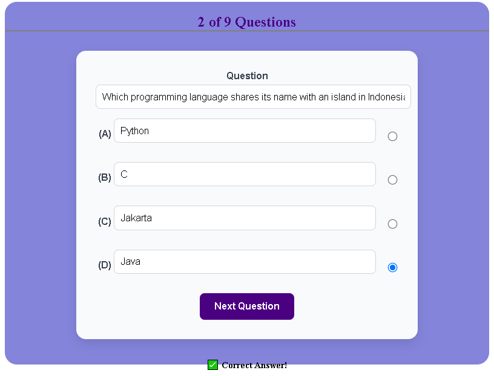
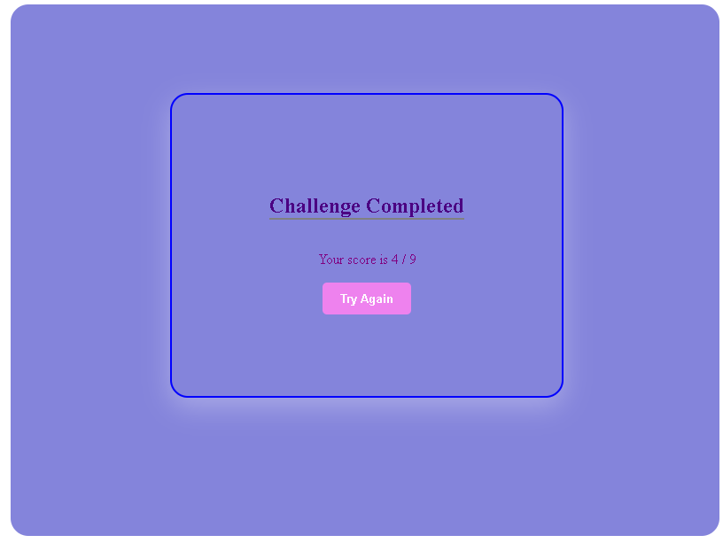

# My Open Trivia Project- Single Page Application
This Trivia Quiz Game is an interactive and responsive SPA where users get to answer a set of questions one after the other. The questions are mainly about computers and the answers are structured and designed in the multiple-choice format.
This web app fetches its questions from a live server which is spcifically [the Open Trivia Database API](https://opentdb.com/api_config.php). Other features are as shown below;
## Project Features
- Fetching random computer-related questions from a remote API
- The web app renders questions and choices for answers dynamically
- It evaluates selected answers in real-time
- The app gives immediate feedback on each selected answer
- It tracks the score at the end of the quiz
- Includes an option for trying again incase the user is unsatisfied with their score
- includes a responsive and modern UI
## Project Structure
### Index.html that offers structure and layout
### style.css that makes primary styling possible
### index.js that brings logic and functionality to the application
## Technologies Used to Make this App
- HTML5
- CSS3
- JavaScript (Vanilla)
- Open Trivia DB API
## How to Get Started
1. Clone this repository using the 'git clone' command in your terminal. It should look something like this;
```
git clone git@github.com:Moringa-SDF-PT10/joseph-kamau-trivia-project.git
```
2. Open the web app by opening your index.html in the web browser of your choice.
3. Right-click inside the HTML file and select the `open with live server` option.
4. Installed Live Server is a prerequisite for step 3. Here is a detailed guide on how to install the [Live Server Extension](https://www.geeksforgeeks.org/how-to-enable-live-server-on-visual-studio-code/) into your VS Code editor. 
## The App in Action
Here are a few screenshots of how this web app looks in action




## Future Improvements
- Include a high score tracking that stores locally
- Include a timer functionality
- Support extra question categories and difficulty levels
- Improve responsiveness especially on mobile devices
- Add animations or sound effects
## Author
Joseph Mwangi Kamau
## License
This Single Page Application project is open-source.